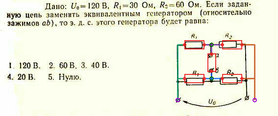

# ElectroScholar

[](https://github.com/ilachev/electro-scholar/actions/workflows/ci.yml)

ElectroScholar is a cross-platform electrical engineering learning project. It
combines a recovered legacy question bank with a modern Kotlin Multiplatform
application and a reviewable pipeline for turning technical images into
machine-readable formulas and circuit graphs.

The current corpus is Russian. The data contracts and tooling are deliberately
language-independent.



## Current capabilities

- Reproducible extraction of 582 questions, 2,685 answers, 10 topics, and 582
  JPEG images from a 16-bit educational application.
- A runnable Compose Multiplatform desktop application backed by SQLite and
  SQLDelight.
- A deterministic media inventory and a balanced 50-image annotation pilot.
- Versioned `Observation IR v1` and `Circuit IR v1` JSON Schemas.
- Semantic validation of components, pins, nets, operating states, provenance,
  and drawing layout.
- Source-image overlays for human verification of reconstructed schematics.

## Architecture

```text
Legacy database -> Python extractor -> SQLite + immutable JPEG
                                      |
Technical images -> Python CV/ML worker -> Observation IR
                                      |
                                      v
                                  Circuit IR
                                      |
                     KMP review UI / SPICE / KiCad / CircuitikZ
```

Python is an offline data and ML layer. The end-user application does not
require Python. SQLite, JSON Schema, and JSON keep the recovered and reviewed
data independent of any particular runtime.

## Run the desktop application

Requirements: JDK 21. Gradle dependencies are resolved by the checked-in
wrapper and locked by `gradle.lockfile`.

```bash
cd kmp-app
./gradlew :composeApp:run
```

## Run the data checks

```bash
python3 -m venv .venv
.venv/bin/python -m pip install -r requirements-analysis.txt
.venv/bin/python -m unittest discover -s tests -v

.venv/bin/python tools/validate_technical_ir.py \
  analysis/examples/observation-ir-example.json \
  analysis/examples/circuit-ir-example.json
```

## Repository layout

- `analysis` - recovered database, media inventory, schemas, and examples.
- `tools` - legacy decoder, media analysis, IR validation, and Ghidra scripts.
- `kmp-app` - Kotlin Multiplatform desktop application.
- `tests` - data-pipeline and schema conformance tests.
- `dist` - metadata for reproducible local packages; binaries are not tracked.

Detailed technical-data documentation is in
[`analysis/TECHNICAL_DATA.md`](analysis/TECHNICAL_DATA.md). The latest local
checkpoint is documented in [`CHECKPOINT.md`](CHECKPOINT.md).

## Data provenance and rights

The legacy executable and original archives are intentionally excluded from
Git. The repository does contain an extracted educational question bank and its
images for preservation, interoperability research, and migration work.

Ownership and licensing of that legacy content have not yet been established.
No license grant for third-party question text or images is implied. See
[`DATA_PROVENANCE.md`](DATA_PROVENANCE.md) before redistributing the corpus.

No open-source license has been selected for the newly written code yet.
